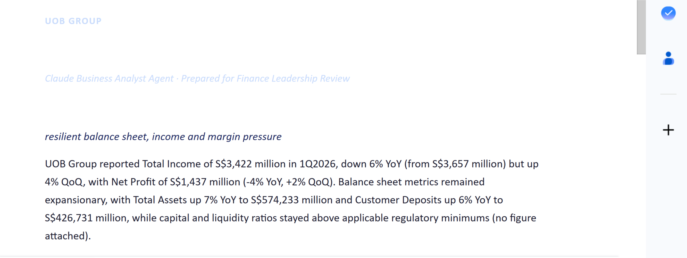
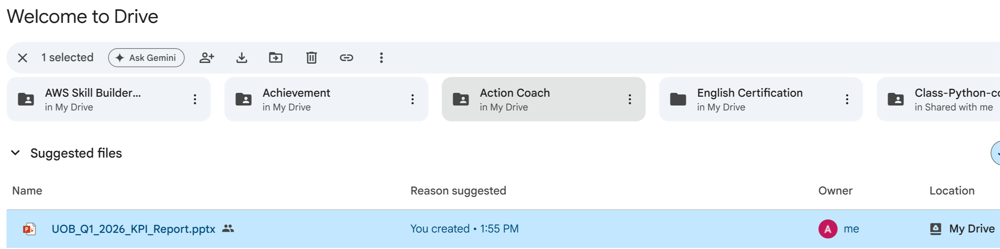
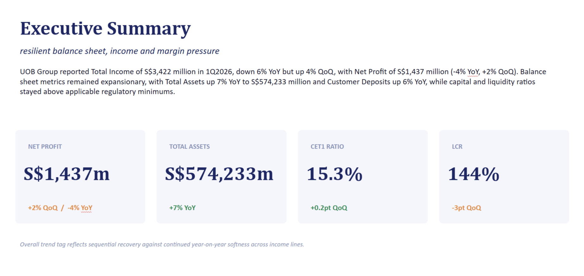
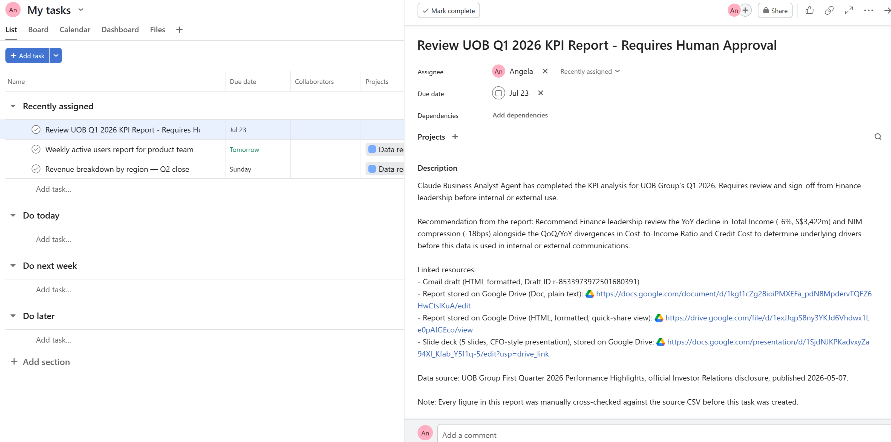

# Bank KPI Business Analyst Agent

### Demonstrated with UOB Group's real, publicly disclosed Q1 2026 results


**An AI agent that drafts a quarterly bank KPI review in minutes instead of hours — with built-in AI-hallucination detection and mandatory human sign-off before anything leaves the building.**

Built with Claude API (Anthropic), Python, and MCP (Gmail, Google Drive, Asana) as a capstone project for an intensive Claude/AI engineering curriculum. Analyzes UOB Group's real, publicly disclosed Q1 2026 financial results.

---

## The Business Problem

Every quarter, a bank's Finance team has to turn a wall of raw KPIs into a plain-English review: what improved, what didn't, and what needs escalating before the numbers go anywhere near a client, a regulator, or an investor deck. Done manually, that first-draft-to-insight step routinely eats a full day of a Financial Analyst's time — not because the analysis is hard, but because translating 30+ metrics into a coherent narrative is slow, repetitive work.

This agent answers one specific business question every quarter:

> *"How did the bank perform this quarter versus last quarter and versus a year ago, and what needs a human's attention right now — without waiting for someone to spend half a day reading spreadsheets?"*

It does not replace the analyst's judgment. It removes the repetitive first draft so the analyst's time goes to what a human is actually needed for: catching what the model missed, deciding what matters, and taking accountability for the final call.

---

## Architecture

```
uob_kpi_q1_2026.csv (31 real KPIs, sourced + formula-annotated)
              │
              ▼
      Claude API  ◄── system_prompt.py (20 rules, 4 layers)
              │        Strict Rules → Quality Standards →
              │        Compliance & Disclosure → Security & Sourcing
              ▼
   analysis_report.json (verified, structured JSON)
              │
   ┌──────────┼──────────────┐
   ▼          ▼              ▼
 Gmail      Google Drive    Asana
 draft      (Doc + HTML +   task
 (unsent)    Slides)        (pending_approval)
   └──────────┴──────────────┘
              │
     Human Approval required
     before any external use
```

Steps 1–3 (data prep → API call → JSON) run as a standalone Python script. Steps 4–6 (Gmail, Drive, Asana) are executed through Claude with MCP connectors under direct human supervision — deliberately, not automated end-to-end. See [Governance & Compliance Design](#governance--compliance-design) for why.

---

## Getting Started

```bash
# 1. Clone and enter the project
git clone https://github.com/<your-username>/uob-kpi-business-analyst-agent.git
cd uob-kpi-business-analyst-agent

# 2. Create a virtual environment and install dependencies
python -m venv venv
venv\Scripts\activate        # Windows
pip install -r requirements.txt

# 3. Set your Anthropic API key as an environment variable
#    (never hardcode it in the code)
setx ANTHROPIC_API_KEY "your-key-here"     # Windows
# export ANTHROPIC_API_KEY="your-key-here" # macOS/Linux

# 4. Run the pipeline
python business_analyst_agent.py
```

Output: `data/analysis_report.json` (structured analysis) and `data/email_draft.txt` (formatted email draft). Steps 4–6 (actually creating the Gmail draft, saving to Drive, creating the Asana task) require MCP connectors, which run through Claude rather than this standalone script — see [Architecture](#architecture) above.

---

## Case Study: Catching an AI Hallucination

This is the part of the project I'm proudest of, and the one most worth reading if you're evaluating whether I understand AI risk, not just AI APIs.

**What happened:** On the first run, the agent's key-highlights section stated that UOB's Liquidity Coverage Ratio (144%) was *"comfortably above the MAS Notice 651 minimum of 100%."* The 144% is real, sourced directly from the input CSV. The **"100% minimum" is not.** It never appeared anywhere in the data I gave the model — Claude pulled it from its own general knowledge and stated it as if it were a sourced fact.

The number itself happens to be accurate in the real world. That is exactly why it's dangerous: a hallucinated figure that's also correct is much harder to catch than an obviously wrong one, and it will pass a casual read.

**What I did about it:**

| Run | Behavior | Fix applied |
|---|---|---|
| 1 | States a specific unsourced regulatory threshold as fact | Added rules requiring every figure to be traceable to a CSV row, or tagged `[UNSOURCED]` |
| 2 | Softer relapse — claims the number is *"referenced in the data"* when it isn't | Closed the loophole: banned attaching any percentage to regulatory language at all, and banned false source-attribution specifically |
| 3–4 | Clean. Model self-corrects to *"remains above the applicable regulatory minimum (no figure stated)"* | Verified by manually cross-checking every line of both runs against the source CSV |

**The takeaway I'm carrying forward:** no system prompt, however well-written, guarantees an LLM won't fabricate a plausible-sounding detail. That's not a reason to avoid deploying AI in a regulated environment — it's the reason a Human Approval checkpoint isn't a compliance formality. It's the actual last line of defense, and this project is built with that as a first-class design constraint, not an afterthought.

---

## Key Findings — UOB Group, Q1 2026

Generated by the agent, verified line-by-line against the source document before use here.

- **Net Profit** rose 2% QoQ to S$1,437m but remained 4% below the year-ago quarter (S$1,490m)
- **Total Income** fell 6% YoY to S$3,422m despite a 4% QoQ recovery
- **Net Interest Margin** compressed 18 bps YoY to 1.82%, continuing a multi-quarter margin pressure trend
- **Total Assets** grew 7% YoY to S$574,233m — balance sheet expansion held up even as income softened
- **CET1 Ratio** improved to 15.3% (+0.2pt QoQ), a well-capitalised position
- **Cost-to-Income Ratio** improved QoQ (44.5%, from 46.4%) but worsened YoY (from 42.6%) — an explicit divergence the agent is designed to flag, not smooth over

---

## Governance & Compliance Design

Modeled on how large banks are actually deploying LLM agents in 2026, not on a hypothetical best practice.

- **Human Approval is enforced by design, not just claimed.** Every output carries `requires_human_approval: true`, and no step in the pipeline sends anything external without a person in the loop — mirroring the "AI drafts, human signs" principle behind [Anthropic's Claude for Financial Services](https://www.anthropic.com/news/finance-agents), a production reference architecture used by banks including Citadel, BNY, and Carlyle.
- **AI-generated content is always disclosed.** Every report carries a standing disclaimer identifying it as AI-drafted, not a final document.
- **No investment advice.** The agent explains what the reported numbers show; it does not recommend buy/sell decisions — that's regulated activity outside its scope.
- **Prompt-injection aware.** Any text inside the input data is treated as data, never as an instruction — a pattern borrowed directly from Anthropic's own [Earnings Reviewer](https://github.com/anthropics/financial-services) reference agent.
- **Aligned with current regulatory guidance.** FINRA's 2026 Annual Regulatory Oversight Report calls for documented human sign-off, narrow tool scope, and audit trails for any AI agent capable of independent action — this project's design checklist maps directly onto that guidance.

The full 20-rule system prompt is in [`system_prompt.py`](./system_prompt.py), organized into four layers: Strict Rules (no fabricated numbers), Quality Standards (balanced, evidence-cited analysis), Compliance & Disclosure, and Security & Sourcing.

---

## Data Source & Provenance

All figures come from UOB Group's **First Quarter 2026 Performance Highlights**, an official investor disclosure published 7 May 2026 and retrieved directly from UOB's Investor Relations site (primary source, not a news aggregator or secondary summary).

- Source: [UOB Group Investor Relations](https://www.uobgroup.com/investor-relations/assets/pdfs/investor/financial/2026/performance-highlights-1q-2026.pdf)
- Publication date: 2026-05-07

**Known limitation:** the Cash Flow Statement is not included in this dataset. Under SGX Listing Rules, banks are only required to publish full Cash Flow Statements at Half Year and Full Year — Q1/Q3 "Trading Updates" are exempt. This isn't a data-collection gap; it's the actual disclosure regime, and the agent is designed to state that limitation explicitly (`data_gaps_noted`) rather than paper over it.

This project uses UOB's real, publicly disclosed financial data for educational and portfolio purposes. It is not affiliated with, sponsored by, or reviewed by UOB Group.

---

## Live Evidence

This isn't a mocked demo — every artifact below was created by the agent through real API/MCP calls, not hand-written.

**Gmail draft (HTML, unsent, pending review)**


**Google Drive — report saved as a Doc**


**Executive summary slide (from the 5-slide deck)**


**Asana task, flagged for human approval**


---

## Tech Stack

| Component | Choice |
|---|---|
| Language | Python 3.12 |
| LLM | Claude Sonnet 5 (Anthropic API) |
| Data handling | pandas |
| Actions (draft/save/task) | MCP — Gmail, Google Drive, Asana |
| Presentation | HTML email (generated by the pipeline); executive slide deck created with Claude's built-in document-generation tooling |

---

## Repository Structure

```
uob-kpi-business-analyst-agent/
├── README.md
├── business_analyst_agent.py   # main pipeline: CSV → Claude API → JSON → email draft
├── system_prompt.py            # 20-rule System Prompt, 4 governance layers
├── requirements.txt
├── .gitignore
├── data/
│   ├── uob_kpi_q1_2026.csv     # 31 real KPIs, source + formula annotated
│   └── analysis_report.json    # sample verified output
├── UOB_Q1_2026_KPI_Report.pptx # the actual slide deck (open it, don't just look at the screenshot)
└── screenshots/
    ├── gmail_draft.png
    ├── asana_task.png
    ├── drive_doc.png
    └── slide_deck.png
```

---

## Limitations & Next Steps

Being upfront about what this is *not*, because that's part of doing this honestly:

- Analyzes a single quarter; no multi-period trend tracking yet
- Google Drive/Gmail/Asana actions currently run through Claude's MCP layer, not a fully autonomous pipeline — deliberate, per the Governance section above, but worth automating further with proper approval gating
- The slide deck currently uploads to Drive manually after a binary-encoding issue with the automated upload — a good example of why file-type matters when designing automation (text payloads are far more reliable over API than binary ones)

**Planned next:**
- Re-run against UOB's Q2 2026 results (expected late July/August 2026) to validate the pipeline holds up on a second, independent dataset
- Add `web_search` so the agent can pull the next quarter's figures itself instead of requiring manual CSV prep
- Extend into a multi-agent design (a second model reviewing the first's output before it reaches a human) — the natural next step in the curriculum this project comes from

---

## Author / Portfolio

Part of an ongoing portfolio applying AI and data science to banking and financial services. Related projects:

- [`bank_loan-default-prediction`](https://github.com/angelaadida/bank_loan-default-prediction) — XGBoost credit risk model (AUC-ROC 0.94), deployed on Streamlit, with a Claude API layer adding natural-language risk explanations
- More banking-focused ML/BI projects: [github.com/angelaadida](https://github.com/angelaadida)

Background: 15+ years in banking operations, transitioning into data science and AI engineering.
